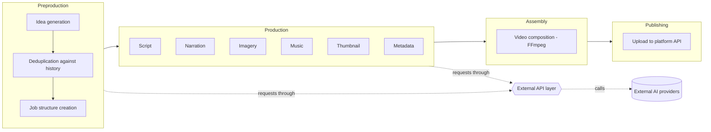

# LIA

**Note:** the source code is private. This document describes the system's architecture and the reasoning behind its design decisions. Available for review on request.

## What this system does

LIA is a backend system I built to automate the end-to-end production of narrated video content: generating the underlying idea and script with a language model, producing narration and background music from that script, composing imagery into a finished video, and publishing the result to a video platform through that platform's API. It runs unattended on a schedule, without a human triggering or supervising each run.

This README describes the engineering behind that system — how it's structured, how it talks to external services, how it handles partial failure, and the reasoning behind those choices. The content-specific logic (what the system actually produces) is intentionally out of scope here: this document is about the plumbing, not the product.

I built this solo, as a way to practice designing a system that depends on multiple third-party AI services in production — not as a one-off script, but as something meant to run daily, fail safely, and recover without manual intervention.

## Architecture

| Layer | Responsibility |
|---|---|
| Preproduction | Generates candidate content ideas, filters out duplicates against a historical registry, creates the per-run working directory structure |
| External API layer | Single entry point for every outbound call to a generative AI provider; the rest of the system never talks to a provider directly |
| Production | Generates each piece of content for a single item: script, narration, imagery, music, thumbnail, metadata |
| Assembly | Combines narration, imagery, and music into a finished video file via FFmpeg |
| Publishing | Uploads the finished video and its metadata to the target platform through that platform's API |
| State tracking | Per-item status file that lets a batch run resume after a crash or interruption instead of restarting from scratch |
| Asset banks | Pools of pre-generated, reusable assets (images, music, thumbnail bases), distributed across items instead of regenerated per item |

## Design decisions

### A single entry point for all external API calls

**Problem:** the system talks to several generative AI providers, each with a different SDK, authentication method, and response shape. If every module that needed generated content called its provider directly, swapping a provider or adding a new one would mean touching every call site, and error handling would drift out of sync between modules.

**Decision:** every outbound call goes through one function that takes the provider, the model, the prompt, the expected output type, and optional parameters. A router resolves the provider name to its implementation. Adding a new provider means writing one adapter and registering it — no changes anywhere else in the codebase. No module is allowed to import a provider SDK directly; this is enforced as a project rule, not just a convention.

### Response validation registered by data type, not by task

**Problem:** different generation tasks expect different response shapes (plain text, a list of strings, a list of structured objects, a batch of images, an audio file), and a provider can return something that doesn't match what was asked for. Validating this per task led to duplicated, inconsistent checks.

**Decision:** a validator is registered per *expected output type*, not per task. Any task that needs, say, "a list of structured objects" reuses the same contract and the same guarantees as every other task that needs that type. This also absorbs known provider quirks explicitly — for example, some providers wrap structured JSON output in markdown code fences, or return a number as a string — instead of trusting that the provider's raw output matches the request.

### Fail-fast vs. fallback, decided per field

**Problem:** the system runs unattended. A hard failure on any malformed field would abort an entire batch over a minor issue; but silently substituting a default for every malformed field risks corrupting content that depends on it being correct.

**Decision:** I didn't apply one policy system-wide. For fields the rest of the item depends on being correct, a malformed value fails that item and the batch continues with the rest. For a secondary attribute that only affects presentation and where a reasonable default exists, a malformed value is replaced with that default and logged as a warning, without stopping production. The distinction is made explicitly, field by field, rather than defaulted to one blanket rule.

### A state machine per item, with resumability

**Problem:** a full run is long, unattended, and can be interrupted by a crash, a network failure, or a provider rate limit. Restarting from scratch would repeat API calls that already succeeded — calls that cost money and time.

**Decision:** each item's work is broken into named stages, tracked in a small per-item status file (pending / active / failed). On startup, the system checks for unfinished work from the current run before generating anything new, and each stage is skipped if it's already marked complete. A failure in one item is recorded and the batch moves on to the next one instead of halting.

### Keeping related fields bundled through list transformations

**Problem:** preproduction generates each content item as a small set of related fields that have to stay linked by position across several list-level transformations (deduplication, filtering, substitution) before being split into separate lists right before being written to disk. An earlier version of this normalized and filtered those lists separately and re-paired them by index afterward — which is fragile: any transformation that drops or reorders even one entry silently breaks the pairing between fields that belong to the same item, with no error to signal it.

**Decision:** related fields are kept bundled as a single unit through every transformation step, and only split into separate lists once, immediately before the point where they're persisted. Where two related fields must exist together on disk, they're written in a single atomic write, so a crash can never leave one written without the other.

### Pre-generated asset pools with a circular pointer

**Problem:** some assets (images, background music, thumbnail bases) are expensive to generate but don't need to be unique per output item. Generating one per item would scale API cost linearly with output volume for no real benefit.

**Decision:** a fixed batch of assets is generated ahead of time and stored. Each new item pulls the next asset through a circular pointer that wraps around and tracks how many full passes it has made. Once the pointer completes a configured number of passes, the pool is automatically refreshed. This decouples the cost of asset generation from the frequency of content generation.

## Stack

- **Runtime:** Python 3.13
- **Dependencies:**
  - `openai` 2.7.2 — LLM text generation and image generation
  - `requests` 2.32.5 — HTTP calls to the voice/music provider
  - `python-dotenv` 1.1.1 — environment variable / secrets loading
  - `Pillow` 12.1.1 — image manipulation (normalization, thumbnail composition)
  - `schedule` 1.2.2 — local scheduling for development runs
  - `google-auth` 2.53.0, `google-auth-oauthlib` 1.4.0, `google-api-python-client` 2.196.0 — OAuth2 and API client for the publishing platform
- **External services:** an LLM API (text and image generation), a text-to-speech / music generation API, a video platform's data API for publishing
- **External binary:** FFmpeg, invoked via subprocess for video assembly
- **Deployment:** scheduled execution on a home server for production runs; local scheduling for development

## Project status

Working and exercised against live provider APIs, individually: idea generation and deduplication, script generation, narration, the image and music asset pools, thumbnail composition, video assembly, and publishing to the target platform.

The current data model for content items — each item carrying an extra classification attribute alongside its core fields — was added recently. It's covered by unit-level verification (parsing, validation, folder creation) but has not yet been exercised through a full live run end to end; that's the immediate next step.

An error-classification and recovery layer is scaffolded but deliberately not wired into the pipeline yet. Per an MVP-first approach, it's intentionally deferred until the core pipeline has been validated end to end — no point hardening error recovery for a path that hasn't fully run yet.

Publishing currently targets a single platform. The publishing layer is structured so a second platform could be added without changing the rest of the pipeline, but that hasn't been exercised in practice.
